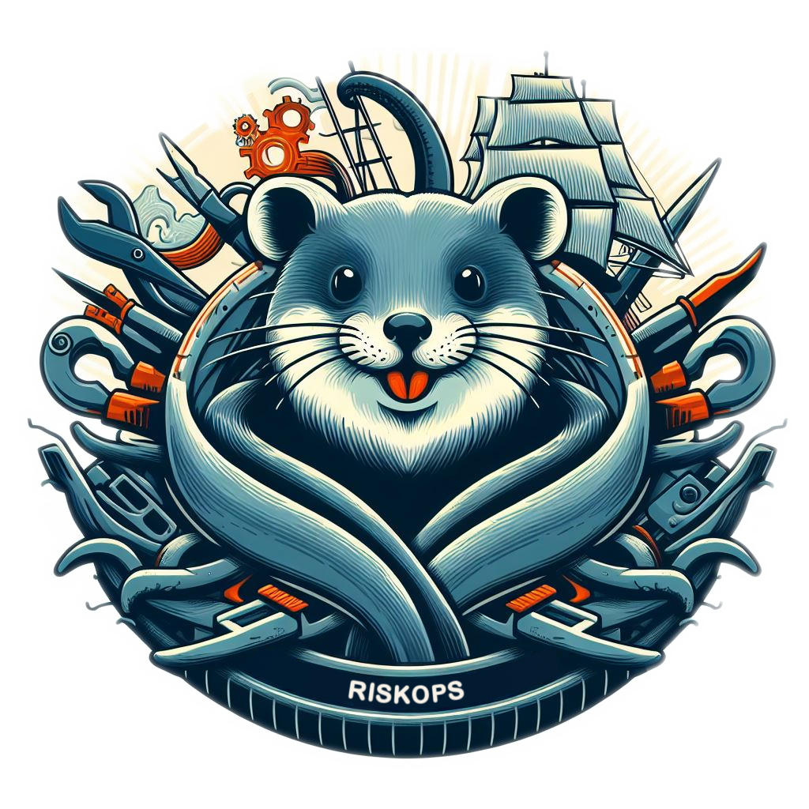

    

<h1 align="center">🚨 RISKOPS 🚨</h1>

Dear CISOs, DevOps, and Compliance enthusiasts, 

How do you manage your governance, risk, and compliance (GRC) in a fast-paced DevOps environment? How do you ensure that your software development lifecycle is secure, compliant, and risk-free <b>before</b> it is deployed to production?

All of the GRC solution today are centrelized and not integrated with the CI/CD pipeline. This makes it difficult to enforce GRC standards, automate compliance checks, and streamline risk management in your software development lifecycle.

RISKOPS  is a community-driven project. We need your insights, user stories, ideas, dos and don'ts, and expertise to make this tool not just functional, but exceptional. If you're passionate about creating technology that empowers and enforces GRC standards, please contribute by [sharing your input](/issues). 📯🦦

